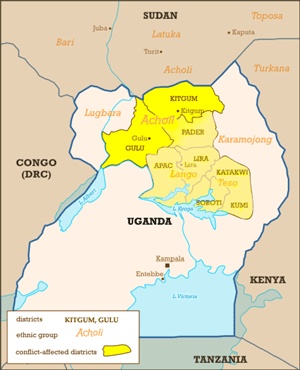

Overview
========

RapidSMS-CVS is an SMS reporting system designed to assist community
vulnerability surveillance using SMS reporting.

License
-------

This software is made available as-is under the BSD license.

Pilot Project
-------------

The system is being piloted by UNICEF Uganda in the Acholi region of
Uganda.

